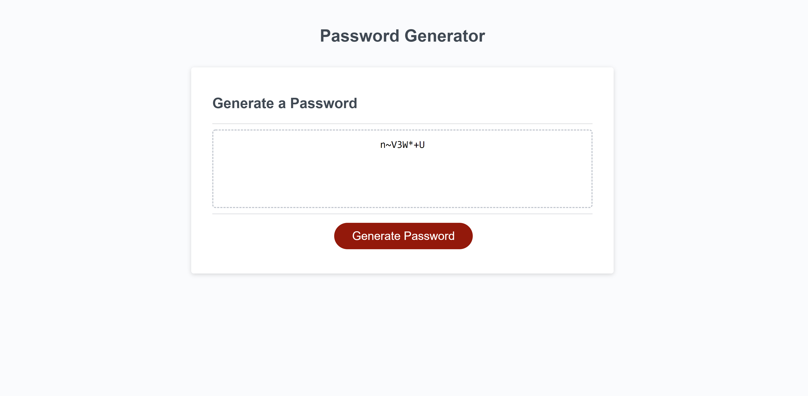

# PassGem - A Password Generator

## Purpose

The purpose of this page is to take user input for password length and content criteria; upper case letters, lower case letters, special characters, and numbers. Then display the password on the page based on the input. The criteria should be asked each time the 'generate password' button is pressed.

## Challenges

My main challenge in creating the password generator was using the switch statement. I had trouble ensuring that the array would iterate correctly when certain criteria were false. I also had difficulty accessing the object method for the criteria repsonses in a stable manner. At first I had the window prompts with the object, but that made it unable to be called for repeated password entries. 

## Function structure

The functions are called in the following structure

1. writePassword ()
    - generatePassword()
        - lengthResponse()
        - charPrompts()
        - randomFill()
            - switchSelector()
                - random()
            - randomCase()
                - random()

## Deployed Page

https://atticus-robinson.github.io/PassGem/

## Page Image

